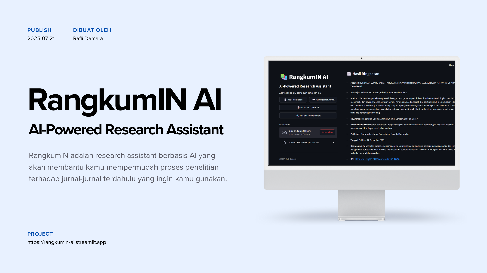

<h2>RangkumIN: AI-Powered Research Assistant</h2>

 

## Overview

RangkumIN is an AI-based research assistant that will help you simplify the research process for previous journals you want to use. Built with Deepseek AI support, RangkumIN is a tool capable of performing various tasks that will simplify your research work. Combined with connections to various journal databases on arXiv, RangkumIN is ready to help you find journals relevant to your current research topic.

## Project Link

[Click here](https://rangkumin-ai.streamlit.app) to take you to the RangkumIN AI project website.

## Features

- Answer your questions automatically and naturally.
- There are no limits and quotas for asking questions. Ask as much as you like.
- Always ready 24/7 anytime and anywhere without operating hours.

## Tech Stack

- **Python**:  A versatile programming language used for web development, machine learning, and more.
- **Streamlit**: A Python library for creating interactive web apps for data science and machine learning.
- **TensorFlow**: A popular deep learning framework, used to build and train a variety of machine learning models.
- **NLTK**: A leading platform for building Python programs to work with human language data.
- **Adam Optimizer**: An optimization algorithm used in training neural networks.
- **GitHub**: A platform for help host and managing code projects.
  
## Dataset

No dataset is used. The data source is a json file containing a collection of self-built conversations.

## How to Use This Code?

We welcome contributions to this project. Please follow these steps to contribute:

1. **Clone this repository to your computer** (`git clone https://github.com/Rfldmr/smare.ai-smart-automation-report.git`)
2. **Read the requirements.txt file in the repository, make sure you have installed everything needed according to the version listed.**
3. **Open the file named app.py which is in the repository.**
4. **Install the Streamlit framework with the following command** (`pip install streamlit`).
5. **Run the following command to run the program on localhost** (`python -m streamlit run app.py`).

## Model Evaluation

- Accuracy score: 0.9952
- Loss: 0.0068

## Reference

Meme, T. (2024). *Building a Chatbot with Python*. Codepolitan. [Click here](https://www.codepolitan.com/blog/membangun-chatbot-dengan-python)

## Copyright

© 2025 Rafli Damara.
